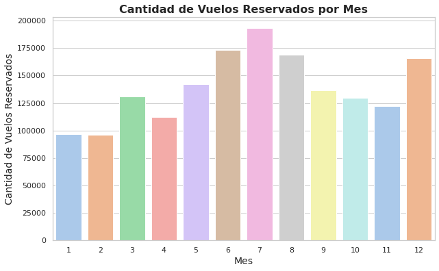

# Módulo 3: Ejercicio de Evaluación Final

Este repositorio contiene el código desarrollado para el ejercicio de evaluación final del Módulo 3 del curso de análisis de datos. El objetivo es realizar un análisis de los datos relacionados con el comportamiento de clientes en un programa de lealtad de una aerolínea.

## Objetivo

El propósito del ejercicio es analizar las diferencias en el número de vuelos reservados por los clientes según su nivel educativo, utilizando técnicas de análisis de datos, visualización y pruebas estadísticas.

## Fases del Proyecto

### 🔍🧹 Fase 1: Exploración y Limpieza de Datos
- **Exploración inicial**: Identificación de valores nulos, outliers y estructura de los datos.
- **Limpieza de datos**: Tratamiento de valores nulos, verificación de consistencia y preparación de los datos.
- **Unión de los datos**: Fusión de los archivos `Customer Flight Analysis.csv` y `Customer Loyalty History.csv`.

### 📊🎨 Fase 2: Visualización de Datos
Se crearon visualizaciones para responder a preguntas clave como:
- Distribución de vuelos por mes.
- Relación entre distancia volada y puntos acumulados.
- Comparación del salario promedio por nivel educativo.

### ✈️🎓📈 Fase 3: Análisis de Diferencias en Vuelos por Nivel Educativo
- **Análisis descriptivo**: Agrupación por nivel educativo y cálculo de estadísticas como promedio y percentiles.
- **Prueba A/B Testing**: Evaluación de si existen diferencias significativas en vuelos reservados entre los diferentes niveles educativos.

## Requisitos

- Python
- Librerías principales: **Pandas**, **Matplotlib**, **Seaborn**, **Scipy**.

## 📝✅ Conclusión

En esta evaluación, he explorado y analizado los datos de un programa de lealtad de una aerolínea para comprender las diferencias en el comportamiento de reserva de vuelos según el nivel educativo de los clientes. A través de un análisis descriptivo y una prueba A/B Testing, pudimos evaluar si existen diferencias significativas entre estos grupos.

Los hallazgos obtenidos proporcionan una base sólida para futuras decisiones estratégicas en cuanto a las promociones y programas de lealtad, ya que evidencian patrones de comportamiento que pueden ser aprovechados para mejorar la relación con los clientes y aumentar la retención.

## 📫 Contacto

Si tienes alguna duda o quieres discutir más sobre este proyecto, puedes contactarme a través de:

- 📧 Email: [maria.elvira8@gmail.com](maria.elvira8@gmail.com)
- 💼 LinkedIn: [María Ibáñez Elvira](https://www.linkedin.com/in/mariaibanezelvira)

¡No dudes en escribirme!
